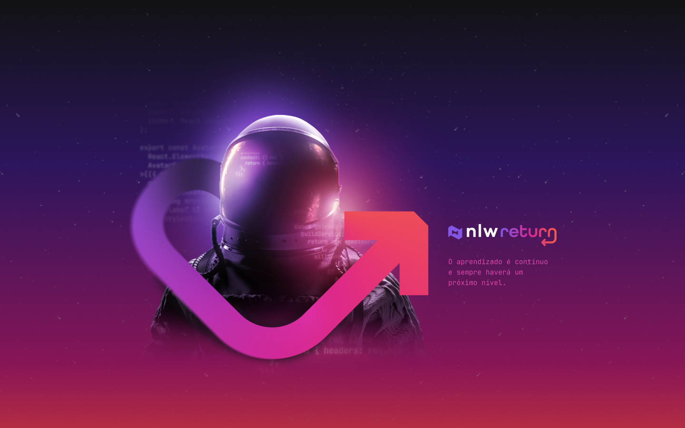

<div align='center'>
  
</div>

## Sobre o projeto 💬

O **nlw-return-impulse-web** é uma aplicação front-end desenvolvido no nlw-return da rocketseat.

## Funcionalidades 🧠

A aplicação contém as seguintes funcionalidades:

### Main.tsx 📕

- [x] Envia um feedback para o suporte sobre o ocorrido, seja ele um bug, uma ideia ou outros tipos de assuntos.
- [x] Após o envio, um email é direcionado para que o suporte tenha noção sobre o feedback reportado.


## Pré-requisitos
#### Antes de começar, é bom ter instalado em sua maquina as seguintes ferramentas:
- [x] [GIT](https://git-scm.com/)
- [x] [VSCode](https://code.visualstudio.com/)
- [x] [NodeJs](https://nodejs.org/en/)

### Rodando o Projeto 📖

```bash
# Clone para este repositório
$ git clone <https://github.com/Pedro-AugusCoelho/nlw-return-impulse-web.git>

# Acesse a pasta do projeto no terminal/cmd
$ cd nlw-return-impulse-web

# Instale as dependências
$ npm/yarn install

# Execute a aplicação em modo de desenvolvimento
$ npm run dev

# O servidor iniciará na porta:3000 - acesse <http://localhost:3000>
 
```
## Tecnologias 🛠

Desenvolvido utilizando as seguintes tecnologias:

- [REACTJS](https://pt-br.reactjs.org/)
- [VITE](https://vitejs.dev/)
- [TAILWINDCSS](https://tailwindcss.com/)
- [POSTCSS](https://www.npmjs.com/package/postcss)
- [HEADLESSUI](https://headlessui.dev/)
- [TYPESCRIPT](https://www.typescriptlang.org/)
- [AXIOS](https://www.npmjs.com/package/axios)
- [FIGMA](https://www.figma.com/)

## Desenvolvido ##

- [Rocketseat](https://www.rocketseat.com.br/index)

****************

<p align="center">Feito por: Pedro Augusto 🧑🏽🤙🏽</p>
